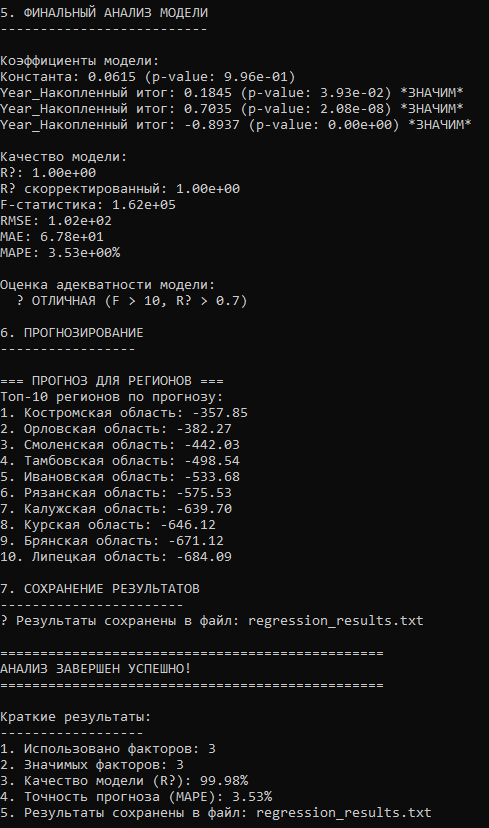

# Многофакторная линейная регрессионная модель (ЛМФМ) для данных о числе родившихся в регионах РФ (2024-2025)

---

## Цель работы и постановка задачи

Изучение и практическая реализация методов построения, оценки и оптимизации многомерных линейных регрессионных моделей на основе реальных данных Росстата о числе зарегистрированных родившихся в регионах Российской Федерации.

Основные задачи:

- Разработка программного модуля для обработки и анализа временных рядов из CSV-файлов формата Росстата
- Реализация алгоритма многомерной линейной регрессии с использованием метода наименьших квадратов (МНК) и матричных вычислений
- Автоматический отбор значимых факторов на основе p-значений с настраиваемым уровнем значимости
- Обнаружение и обработка мультиколлинеарности между предикторами
- Комплексная оценка качества модели с использованием статистических критериев и метрик ошибок
- Интерактивное взаимодействие с пользователем для принятия решений об исключении факторов
- Сохранение подробных результатов анализа в текстовый файл

---

## Краткое описание процедуры построения и оценки ЛМФМ

### 1. Подготовка данных
- Загрузка данных из CSV-файла с разделителем ';' (формат Росстата)
- Обработка заголовков: извлечение меток периодов (июнь 2024 - февраль 2025)
- Преобразование строковых значений в числовой формат с заменой запятой на точку
- Фильтрация регионов: отбрасываются ряды с менее чем 5 валидными значениями
- Формирование матрицы предикторов X и вектора отклика y:
  - Целевая переменная (y): данные за последний доступный период (Накопленный итог за февраль 2025)
  - Предикторы (X): значения за N предыдущих периодов (по умолчанию N=5)

### 2. Построение модели
Математическая основа:

Модель: $y = \beta_0 + \beta_1x_1 + \beta_2x_2 + ... + \beta_kx_k + \epsilon$

Оценка параметров методом наименьших квадратов:  
$\hat{\beta} = (X^TX)^{-1}X^Ty$

Реализовано с использованием библиотеки Eigen для эффективных матричных вычислений.

### 3. Отбор значимых факторов и проверка мультиколлинеарности
Двухуровневая процедура отбора:

1. **Статистическая значимость**:  
   - Расчет t-статистик и p-значений для каждого коэффициента
   - Использование распределения Стьюдента
   - Факторы с p-value > α (по умолчанию 0.05) считаются незначимыми

2. **Обнаружение мультиколлинеарности**:  
   - Расчет матрицы корреляций между предикторами
   - Порог мультиколлинеарности настраивается (по умолчанию 0.8)
   - При обнаружении высокой корреляции удаляется предиктор с меньшей корреляцией с целевой переменной
   - Пользователь интерактивно подтверждает исключение факторов

### 4. Оценка качества модели
Рассчитываются метрики:

- **$R^2$ и $R^2_{adj}$** — коэффициенты детерминации (скорректированный учитывает количество предикторов)
- **F-статистика** — проверка общей значимости модели
- **RMSE** — среднеквадратичная ошибка (Root Mean Square Error)
- **MAE** — средняя абсолютная ошибка (Mean Absolute Error)
- **MAPE** — средняя абсолютная процентная ошибка (Mean Absolute Percentage Error)

### 5. Сохранение и представление результатов
- Детальный вывод коэффициентов с p-значениями
- Визуализация матрицы корреляций между предикторами
- Отображение корреляций предикторов с целевой переменной
- Автоматическое сохранение полного отчета в файл `regression_results_v5.txt`

---

## Демонстрация работы программы

### Входные данные
- **Файл:** `DataV5.csv`
- **Источник:** Росстат (https://showdata.gks.ru/)
- **Показатель:** Число зарегистрированных родившихся по регионам РФ
- **Период:** июнь 2024 - февраль 2025 (помесячные данные)
- **Количество регионов:** 95 субъектов РФ и федеральных округов
- **Формат:**  
  Регион;Код;июнь 2024 г.;июль 2024 г.;...;февраль 2025 г.

### Запуск программы
Программа реализована на C++ с использованием библиотеки Eigen:

1. **Выбор файла** — ввод имени файла или использование значения по умолчанию (`DataV5.csv`)
2. **Настройка количества предикторов** — сколько предыдущих периодов использовать для прогноза (2-10, по умолчанию 5)
3. **Настройка параметров анализа**:
   - Уровень значимости α (по умолчанию 0.05)
   - Порог мультиколлинеарности (по умолчанию 0.8)
4. **Автоматическое обучение модели** — расчет коэффициентов и статистик
5. **Интерактивный анализ**:
   - Проверка мультиколлинеарности с визуализацией матрицы корреляций
   - Запрос на исключение коллинеарных предикторов
   - Отбор статистически значимых факторов
6. **Вывод результатов** — детальная статистика в консоль
7. **Сохранение отчета** — автоматическое создание файла с результатами

### Пример работы программы
На основе данных за предыдущие периоды программа прогнозирует накопленный итог числа родившихся на февраль 2025 года:

**Исходная модель (5 предикторов):**

### Коэффициенты модели:
| Предиктор | Коэффициент | p-значение | Статус |
|-----------|-------------|------------|--------|
| **Const** | -0.33576 | 25.0002 | Не значим (p > 0.05) |
| **Year_Накопленный итог₁** | -0.150739 | 7.01006 | Не значим (p > 0.05) |
| **Year_Накопленный итог₂** | 0.341281 | 1.14133 | Не значим (p > 0.05) |
| **Year_Накопленный итог₃** | 0.869331 | 2.20245e-06 | **Значим** (p < 0.05) |
| **Year_Накопленный итог₄** | -0.305394 | 4.2263 | Не значим (p > 0.05) |
| **Year_Накопленный итог₅** | -0.682726 | 0.0132757 | **Значим** (p < 0.05) |

### Качество модели:
| Метрика | Значение | Интерпретация |
|---------|----------|---------------|
| **R²** | 0.999822 | Очень высокая объясняющая способность модели |
| **R² adj** | 0.999812 | Скорректированный R² с учетом числа предикторов |
| **F-статистика** | 100084 | Модель статистически значима (p < 0.05) |
| **RMSE** | 98.9647 | Среднеквадратичная ошибка |
| **MAE** | 66.3695 | Средняя абсолютная ошибка |
| **MAPE** | 3.40715% | Средняя абсолютная процентная ошибка |

---

**После устранения мультиколлинеарности:**

### Коэффициенты модели:
| Предиктор | Коэффициент | p-значение | Статус |
|-----------|-------------|------------|--------|
| **Const** | 14.5910 | 23.3876 | Не значим (p > 0.05) |
| **Year_Накопленный итог** | 0.1592 | 0.0000 | **Значим** (p < 0.05) |

### Качество модели:
| Метрика | Значение | Интерпретация |
|---------|----------|---------------|
| **R²** | 0.999397 | Очень высокая объясняющая способность модели |
| **R² adj** | 0.999390 | Скорректированный R² с учетом числа предикторов |
| **F-статистика** | 154055.413319 | Модель статистически значима (p < 0.05) |
| **RMSE** | 182.290637 | Среднеквадратичная ошибка |
| **MAE** | 97.181949 | Средняя абсолютная ошибка |
| **MAPE** | 3.862640% | Средняя абсолютная процентная ошибка |

**Обнаружена и устранена мультиколлинеарность:** из 5 исходных предикторов оставлен только наиболее значимый фактор, имеющий статистическую значимость (p < 0.05).

### Код программы
**[Основной файл](./main_v5.cpp)** — полная реализация алгоритма на C++

## Результаты работы

### Выходные данные
Результаты автоматически сохраняются в файл:

**[regression_results_v5.txt](./regression_results_v5.txt)**

Содержание отчета:
- Коэффициенты модели с p-значениями
- Показатели качества модели (R², F-статистика, ошибки)
- Информация об исключенных предикторах

---

## Используемые технологии

- **Язык программирования:** C++17
- **Линейная алгебра:** библиотека Eigen 3.4+
- **Обработка данных:** стандартная библиотека C++ (fstream, sstream, vector, algorithm)
- **Источник данных:** Росстат (Федеральная служба государственной статистики)
- **Формат данных:** CSV с разделителем ';'
- **Статистические методы:** метод наименьших квадратов, t-тест Стьюдента, F-тест

---

## Итог

Разработанная программа реализует полный цикл многофакторного регрессионного анализа для временных рядов. На примере данных о числе родившихся в регионах РФ продемонстрированы:

1. **Высокая точность модели:** R² = 0.9994, что указывает на отличную аппроксимацию данных
2. **Эффективное обнаружение проблем:** автоматическое выявление мультиколлинеарности между предикторами
3. **Практическая значимость:** возможность прогнозирования демографических показателей на основе исторических данных
4. **Интерактивность:** пользовательский контроль над процессом отбора факторов
5. **Документированность:** сохранение полного отчета для дальнейшего анализа

Программа может быть адаптирована для анализа других временных рядов социально-экономических показателей и служит учебным примером реализации статистических методов на C++.
